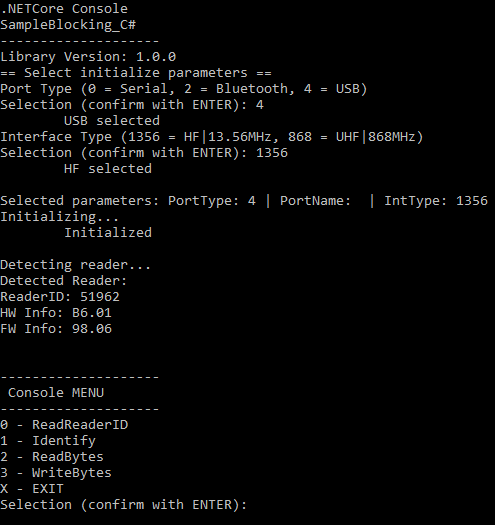
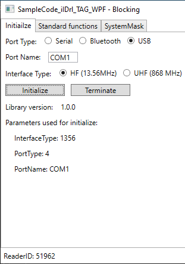

# .NET DOC sample code for RFID transponders
This sample code is for handling both HF and UHF transponders on Windows devices using a Micro-Sensys RFID reader

> For details on DOC communication check [Useful Links](#Useful-Links) 

## Requirements
* IDE (for example Visual Studio)
* Micro-Sensys RFID reader (either Bluetooth or module)
* Any HF or UHF transponder

## Implementation
This code shows how to use **iIDReaderLibrary.DocInterfaceControl** class to read/write transponders. 
For demo purposes, both a .NET Core console and a WPF App as sample code is provided. Inside each solution there are different projects available that show all the different functions provided.
Code used for these projects is written in C# or VisualBasic.

> Class information is available under API documentation. See [Useful Links](#Useful-Links)

## Steps
Just import this project into your Java IDE and run the SampleApp.

 

 1. Select the device parameters to use for *Initialize* (communication port type and name). Once the initialization process finishes, the result will be shown including the Reader ID number.
 2. Use the options (menu or UI) to perform the desired functions

## Useful Links
* [.NET Library NuGet page](https://www.nuget.org/packages/Microsensys.iIDReaderLibrary.DocInterfaceControl/)
* [API documentation](https://www.microsensys.de/downloads/DevSamples/Libraries/Windows/iIDReaderLibrary%20-%20.NET%20library/)
* Check what is possible using our iID®DEMOsoft for PC! Download it using [this link](https://www.microsensys.de/downloads/SW_Install/iID%c2%aeDEMOsoft2020/Setup%20iID%20DEMOsoft%202020.exe)
* GitHub *documentation* repository: [Micro-Sensys/documentation](https://github.com/Micro-Sensys/documentation)
	* [communication-modes/doc](https://github.com/Micro-Sensys/documentation/tree/master/communication-modes/doc)

## Contact

* For coding questions or questions about this sample code, you can use [support@microsensys.de](mailto:support@microsensys.de)
* For general questions about the company or our devices, you can contact us using [info@microsensys.de](mailto:info@microsensys.de)

## Authors

* **Victor Garcia** - *Initial work* - [MICS-VGarcia](https://github.com/MICS-VGarcia/)
